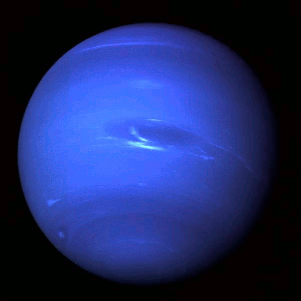
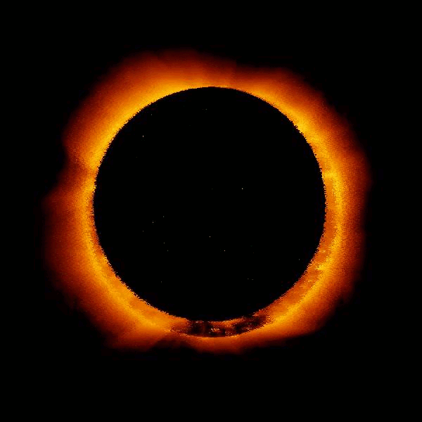
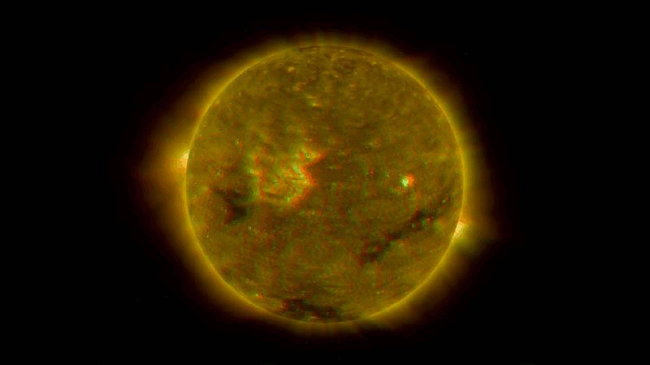

pixelsort
=========

a python attempt at pixel sorting and GIFs

running
=======

    # remember to make the out dir

    mkdir out/
    python pixelsort.py someimage.jpg
    python pixelsort.py --help

    # look in out/ for a bunch of frames
    python pixelsort.py --animate --smooth --rotate --jitter 20 someface.png

viewing
=======

    # for a single image
    open out/output_000.JPG

    # for a GIF, use ImageMagick to animate and preview
    # when ready, load the files in an image editor and create your GIF
    # TIP: not all the frames need to be used in the final GIF
    animate -delay 10 out/output_*.JPG

examples
========

 
`--animate --smooth --rotate --jitter 1`

 
`--animate --smooth --rotate`

 
`--animate --smooth --jitter 1`

 
`--animate --smooth --rotate`

 
`--animate --num-chunks 7 --smooth --distortions 3`

